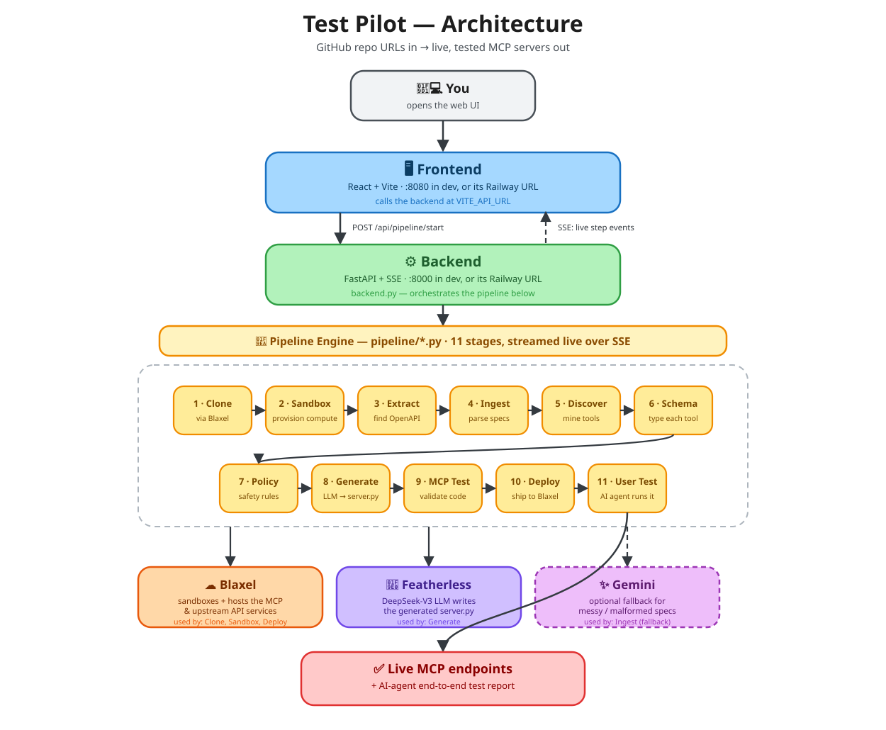

# Test Pilot

**Automated MCP server generation, deployment, and AI-agent testing — from GitHub repos to live endpoints in one click.**

Test Pilot takes GitHub repository URLs containing OpenAPI/Swagger specs, generates MCP (Model Context Protocol) servers, deploys them and the upstream APIs to [Blaxel](https://blaxel.ai), then runs an AI agent to validate everything end-to-end.



---

## How It Works

1. **Clone** — every submitted GitHub repo is cloned into a shared Blaxel sandbox
2. **Sandbox** — compute is provisioned for the run
3. **Extract** — the sandbox is scanned for OpenAPI / Swagger / Postman specs
4. **Ingest** — specs are parsed into endpoints, schemas, and metadata (`pipeline/ingest.py`)
5. **Discover** — MCP tool capabilities are mined from each endpoint (`pipeline/mine.py`)
6. **Schema** — a typed JSON schema is synthesized per tool
7. **Policy** — tools are classified (read / write / destructive) and safety rules applied (`pipeline/safety.py`)
8. **Generate** — DeepSeek-V3 (via Featherless) writes a complete FastMCP server for each API (`pipeline/codegen.py`)
9. **MCP Tests** — generated code is validated (syntax, required files, tool count)
10. **Deploy** — the upstream APIs and the generated MCP servers are shipped to Blaxel
11. **User Test** — an AI agent discovers the live MCP tools and runs an end-to-end test plan against them

Every step streams live to the frontend over Server-Sent Events, so the whole run is watchable as it happens.

## Repository Structure

```
.
├── generate.py                          # CLI: standalone spec → MCP generator
├── pipeline/                            # Core pipeline library
│   ├── ingest.py                        #   Parse OpenAPI 3.x / Swagger 2.x / Postman v2.1
│   ├── mine.py                          #   Discover MCP tools from API endpoints
│   ├── safety.py                        #   Safety classification & execution policy
│   ├── codegen.py                       #   LLM-powered MCP server code generation
│   ├── models.py                        #   Shared data models
│   ├── reasoning.py                     #   LLM reasoning helpers
│   └── logger.py                        #   Logging setup
├── blaxel-swagger-finder/               # Backend API server
│   ├── backend.py                       #   FastAPI + SSE pipeline orchestrator — the real entrypoint
│   ├── scanner.py                       #   Blaxel sandbox repo cloner & spec extractor
│   ├── agent_tester.py                  #   AI agent end-user testing engine
│   ├── app.py                           #   Legacy standalone Streamlit UI (not used by the React frontend)
│   ├── main.py                          #   Legacy CLI wrapper around scanner.py
│   ├── railpack.json                    #   Explicit start command for Railway/Railpack
│   └── upstream_services/               #   Auto-generated upstream API deployments
├── Columbia-Hackathon-Test-Pilot-Frontend/  # React frontend (Vite + TailwindCSS)
│   ├── src/
│   │   ├── components/pipeline/         #   Pipeline UI (sidebar, stepper, step content)
│   │   ├── hooks/usePipeline.ts         #   SSE-driven pipeline state management
│   │   └── pages/Pipeline.tsx           #   Main pipeline page
│   ├── railpack.json                    #   Explicit start command for Railway/Railpack
│   └── vite.config.ts
├── docs/architecture.svg                # The diagram above
├── examples/                            # Sample OpenAPI specs
├── output/                              # Generated MCP server output (git-ignored)
└── .env                                 # API keys (not committed)
```

> `blaxel-swagger-finder/app.py` is an older Streamlit-based UI kept for reference — the supported stack is `backend.py` + the React frontend. Worth knowing if a build tool ever auto-guesses an entrypoint from that folder.

## Quick Start

### Prerequisites

- **Python 3.11+**
- **Node.js 18+** and **npm**
- **Blaxel CLI**: `brew tap blaxel-ai/blaxel && brew install blaxel`

### 1. Install dependencies

```bash
# Backend
cd blaxel-swagger-finder
pip install -r requirements.txt

# Frontend
cd ../Columbia-Hackathon-Test-Pilot-Frontend
npm install
```

### 2. Configure environment

Create a single `.env` in the **project root** — both the CLI and the backend read it from there:

```bash
BL_API_KEY=your-blaxel-api-key
BL_WORKSPACE=your-workspace-name
FEATHERLESS_API_KEY=your-featherless-key
GEMINI_API_KEY=your-gemini-key          # optional fallback
```

| Variable | Required for | Notes |
|---|---|---|
| `BL_API_KEY` / `BL_WORKSPACE` | Clone, sandbox, deploy | Blaxel account — [blaxel.ai](https://blaxel.ai) |
| `FEATHERLESS_API_KEY` | Generate (code-gen) | Powers DeepSeek-V3 — [featherless.ai](https://featherless.ai) |
| `GEMINI_API_KEY` | Ingest (fallback) | Only used to clean up malformed specs |
| `VITE_API_URL` | Frontend, **production only** | Build-time env var — the backend's public URL. Leave unset locally; the Vite dev-server proxy handles `/api` for you. |

Without `BL_API_KEY`/`FEATHERLESS_API_KEY` the pipeline still runs and streams real progress through Clone → Extract, it just can't reach the code-generation or deploy stages — useful for a quick smoke test.

### 3. Run

```bash
# Terminal 1 — Backend (port 8000)
cd blaxel-swagger-finder
python backend.py

# Terminal 2 — Frontend (port 8080)
cd Columbia-Hackathon-Test-Pilot-Frontend
npm run dev
```

Open **http://localhost:8080**, paste GitHub repo URLs, and hit Start.

### Standalone CLI

Generate an MCP server from a spec file without the web UI:

```bash
python generate.py examples/sample.yaml
python generate.py https://petstore.swagger.io/v2/swagger.json --name petstore
python generate.py path/to/spec.json --no-deploy -v
```

## Deploying (Railway)

### Option A — just the UI (zero config)

The repo root has its own `package.json` + `railpack.json` that build and serve the React frontend directly — no Root Directory setting, no env vars, no second service. Connect the repo on Railway and deploy: that's it. This gets you a live link to the UI; the "Start Pipeline" button will error since there's no backend behind it, which is fine for a demo and not fine for a real run.

### Option B — the full working pipeline

For "Start Pipeline" to actually run, the backend needs to be live too, as its own service:

1. Create a **second** Railway service from the same GitHub repo (New → Deploy from GitHub repo again).
2. On it → **Settings → Root Directory** → `blaxel-swagger-finder`. Add the env vars from the table above.
3. On the frontend service (from Option A) → add `VITE_API_URL` set to the backend service's public Railway URL (available once step 1 is deployed) → redeploy so it's baked into the build.

Both service subfolders also ship their own `railpack.json` pinning the exact start command (`python backend.py` / `npm run start`), so Root Directory-based deploys don't have to guess between `backend.py`, `app.py`, and `main.py` in the backend folder.

## Generated Output

Each MCP server is written to `output/<server-name>/`:

```
output/<server-name>/
├── src/server.py        # Complete FastMCP server (LLM-generated)
├── blaxel.toml          # Blaxel deployment config + env vars
├── pyproject.toml       # Python project config
├── test_server.py       # Auto-generated test suite
└── requirements.txt     # Dependencies
```

## Tech Stack

- **Backend**: Python, FastAPI, SSE streaming, Blaxel SDK
- **Frontend**: React, Vite, TailwindCSS, shadcn/ui, Framer Motion
- **LLM**: DeepSeek-V3 via Featherless (code generation), Gemini (spec cleanup fallback)
- **Infrastructure**: Blaxel (sandboxes, serverless functions, MCP hosting)
- **Testing**: AI agent with LLM-generated test plans, narrative + analytical result summaries
